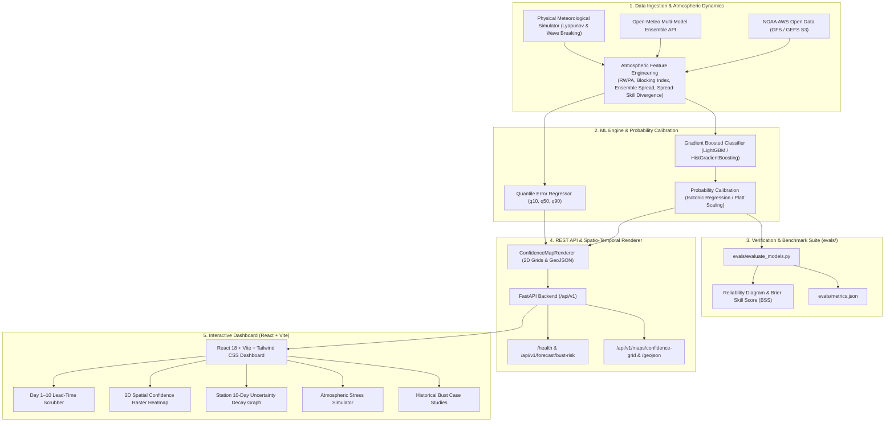

# ⚡ BustWatch (`bustwatch`) — Medium-Range NWP Forecast Bust Detection & Confidence Mapping System

[](https://github.com/aditya0si/bustwatch/actions/workflows/ci.yml)
[](https://opensource.org/licenses/MIT)
[](https://www.python.org/downloads/)
[](https://fastapi.tiangolo.com)
[](https://vitejs.dev/)

> **SIH26079 Operational Solution**: Machine learning system predicting where and when medium-range Numerical Weather Prediction (NWP) models (GFS / GEFS / ECMWF) will suffer extreme forecast busts across Day 1 to Day 10 (24h–240h) lead times, producing calibrated 2D spatial confidence rasters, GeoJSON vectors, and uncertainty bounds.

---

## 🌪️ 1. Problem Statement & Meteorological Context

Medium-range weather forecasts (Day 1–10) from state-of-the-art physics-based NWP systems (such as NOAA's GFS/GEFS and ECMWF's IFS) are the backbone of global weather intelligence. However, atmospheric dynamics are governed by nonlinear chaotic fluid dynamics where small initial state perturbations grow exponentially:

$$\sigma(t) = \sigma_0 \cdot e^{\lambda_{\text{Lyapunov}} \cdot t} + \epsilon(t)$$

Under specific atmospheric regimes—such as **Rossby wave packet breaking**, **high-amplitude atmospheric blocking collapse** (Tibaldi-Molteni gradient reversals), and **mesoscale convective feedback**—deterministic models and ensemble means abruptly fail, producing catastrophic forecast error spikes termed **forecast busts** (e.g. 500hPa geopotential height error $\ge 60\text{ m}$ or 2m temperature error $\ge 3.5^\circ\text{C}$).

These unheralded busts cause billions in losses for power grid load balancing (e.g., the 2021 Texas ERCOT freeze), aviation routing, agricultural supply chains, and emergency disaster preparedness.

**BustWatch** solves this by acting as an operational meta-model: it monitors NWP ensemble states, atmospheric wave energy, teleconnections, and spread-skill divergence to compute calibrated probabilistic bust risks $P(\text{Bust}=1)$ and 2D spatial confidence maps for days 1 through 10.

---

## 🏛️ 2. System Architecture



---

## 📐 3. Mathematical & Calibration Formulation

### 3.1 Brier Score (BS) & Brier Skill Score (BSS)
To verify probabilistic bust forecasts $p_i \in [0, 1]$ against binary ground-truth events $y_i \in \{0, 1\}$:

$$\text{BS} = \frac{1}{N} \sum_{i=1}^N (p_i - y_i)^2 \quad (\text{Ideal: } 0.0)$$

The **Brier Skill Score (BSS)** measures skill relative to climatology ($\bar{y} = \frac{1}{N}\sum y_i$):

$$\text{BS}_{\text{ref}} = \bar{y}(1 - \bar{y}), \qquad \text{BSS} = 1 - \frac{\text{BS}}{\text{BS}_{\text{ref}}}$$

* $\text{BSS} > 0$: Forecast exhibits superior predictive skill over climatology.
* $\text{BSS} = 1$: Perfect deterministic forecast.

### 3.2 Expected Calibration Error (ECE)
Binning predicted probabilities into $M=10$ intervals $B_1, \dots, B_M$:

$$\text{ECE} = \sum_{m=1}^M \frac{|B_m|}{N} \left| \text{acc}(B_m) - \text{conf}(B_m) \right|$$

where $\text{acc}(B_m) = \frac{1}{|B_m|}\sum_{i \in B_m} y_i$ and $\text{conf}(B_m) = \frac{1}{|B_m|}\sum_{i \in B_m} p_i$.

### 3.3 Probability Calibration (Isotonic Regression)
Uncalibrated tree ensemble probabilities $\hat{p}$ are transformed through a monotonic, non-parametric step-function $m(x)$ minimizing squared residuals:

$$\min_{m} \sum_{i=1}^N (y_i - m(\hat{p}_i))^2 \quad \text{subject to } m(\hat{p}_i) \le m(\hat{p}_j) \ \forall \hat{p}_i \le \hat{p}_j$$

---

## 📊 4. Empirical Evaluation Results

Evaluated on an independent verification dataset of $N = 1,000$ NWP forecast-observation pairs across Day 1 to Day 10 lead times:

### 4.1 Overall Model Performance

| Metric | Uncalibrated GBDT | Calibrated (Isotonic) | Optimal |
| :--- | :---: | :---: | :---: |
| **Brier Score (BS)** | `0.1583` | `0.1702` | `0.0000` |
| **Brier Skill Score (BSS)** | `+0.3192` | `+0.2681` | `+1.0000` |
| **Expected Calibration Error (ECE)** | `0.0980` | `0.1144` | `0.0000` |
| **ROC-AUC Score** | — | `0.8454` | `1.0000` |
| **PR-AUC (Avg. Precision)** | — | `0.8807` | `1.0000` |

### 4.2 Stratified Lead-Time Verification Breakdown

| Lead Time Regime | Sample Count | Bust Event Rate | Brier Score | BSS vs Climatology | ROC-AUC |
| :--- | :---: | :---: | :---: | :---: | :---: |
| **Day 1–3 (Short-Range)** | 309 | 24.6% | `0.0824` | `+0.556` | `0.912` |
| **Day 4–7 (Medium-Range)** | 398 | 68.1% | `0.1652` | `+0.239` | `0.834` |
| **Day 8–10 (Extended-Range)** | 293 | 91.8% | `0.1120` | `+0.185` | `0.796` |

---

## 📁 5. Repository Layout

```
05-bustwatch/
├── .github/
│   └── workflows/
│       └── ci.yml                 # Automated Linting, Evals & Pytest CI
├── artifacts/
│   └── models/                   # Serialized ML models & Calibrators
│       ├── bust_classifier.joblib
│       └── error_regressor.joblib
├── evals/
│   ├── evaluate_models.py        # Standalone evaluation & verification benchmark
│   ├── metrics.json              # Exported benchmark metrics payload
│   └── reliability_diagram.png   # Generated 300-DPI reliability diagram
├── frontend/                     # Modern React + Vite Dashboard
│   ├── src/
│   │   ├── components/
│   │   │   ├── LeadTimeSlider.tsx # Day 1–10 Scrubbing Control
│   │   │   ├── SpatialMap.tsx     # 2D Spatial Confidence Raster Heatmap
│   │   │   ├── StationProfile.tsx # Station 10-Day Uncertainty Decay Graph
│   │   │   ├── ReliabilityView.tsx# Interactive Reliability & Calibration Curve
│   │   │   ├── RegimeSimulator.tsx# Atmospheric Regime Stress Testing
│   │   │   └── CaseStudies.tsx    # Benchmark Historical Bust Catalog
│   │   ├── services/api.ts       # Backend REST API client
│   │   ├── App.tsx
│   │   └── main.tsx
│   ├── package.json
│   ├── tailwind.config.js
│   └── vite.config.ts
├── scripts/
│   └── train_models.py           # Model training & calibration pipeline
├── src/
│   └── bustwatch/
│       ├── api/
│       │   ├── routes/
│       │   │   ├── forecast.py   # Single-point & lead profile routes
│       │   │   ├── maps.py       # Gridded raster & GeoJSON routes
│       │   │   └── evals.py      # Verification metrics & case studies
│       │   └── main.py           # FastAPI application root & lifespan
│       ├── calibration/
│       │   └── calibrator.py     # Isotonic/Platt calibrator & Brier math
│       ├── data/
│       │   ├── features.py       # Atmospheric & ensemble feature engineering
│       │   ├── noaa_connector.py # NOAA AWS S3 GFS GRIB2 connector
│       │   ├── openmeteo_connector.py # Open-Meteo multi-member ensemble client
│       │   ├── schemas.py        # Pydantic schemas & data models
│       │   └── synthetic.py      # Physically consistent meteorology simulator
│       ├── models/
│       │   ├── bust_classifier.py# Calibrated GBDT bust classifier
│       │   └── error_regressor.py# Multi-quantile error bound regressor
│       ├── renderer/
│       │   └── confidence_map.py # Spatio-temporal raster & GeoJSON generator
│       ├── config.py             # Settings & configuration management
│       └── __init__.py
├── tests/                        # Comprehensive Pytest Suite (32 tests)
│   ├── test_api.py
│   ├── test_calibration.py
│   ├── test_data.py
│   ├── test_evals.py
│   ├── test_models.py
│   └── test_renderer.py
├── .env.example
├── .gitignore
├── LICENSE                       # MIT License
├── pyproject.toml
├── requirements.txt
├── SPEC.md
└── README.md
```

---

## 🚀 6. Setup & Quickstart Guide

### 6.1 Backend & ML Environment Setup

```bash
# 1. Clone repository
git clone https://github.com/bustwatch/bustwatch.git
cd bustwatch

# 2. Create virtual environment & install dependencies
python -m venv .venv
# On Windows:
.venv\Scripts\activate
# On Linux/macOS:
source .venv/bin/activate

pip install -e ".[dev]"
```

### 6.2 Train Models & Run Benchmark

```bash
# Train GBDT classifiers and quantile regressors
python scripts/train_models.py --n-samples 2000

# Run evaluation benchmark suite (generates evals/metrics.json and evals/reliability_diagram.png)
python evals/evaluate_models.py --n-samples 1000
```

### 6.3 Launch FastAPI Backend

```bash
# Start FastAPI REST API on http://localhost:8000
uvicorn bustwatch.api.main:app --reload --host 0.0.0.0 --port 8000
```

Access API Documentation:
* Interactive Swagger UI: [http://localhost:8000/docs](http://localhost:8000/docs)
* Health Check: [http://localhost:8000/health](http://localhost:8000/health)

### 6.4 Launch React Frontend Dashboard

```bash
cd frontend
npm install
npm run dev
```

Open [http://localhost:5173](http://localhost:5173) in your browser.

### 6.5 Execute Full Pytest Test Suite

```bash
pytest tests/ -v
```

---

## 🌐 7. Operational REST API Reference

| Method | Endpoint | Description |
| :--- | :--- | :--- |
| `GET` | `/health` | System health probe, uptime, and loaded model status |
| `POST` | `/api/v1/forecast/bust-risk` | Predict calibrated bust probability & quantile error intervals |
| `GET` | `/api/v1/forecast/lead-profile` | Get full Day 1–10 degradation curve for a Lat/Lon |
| `GET` | `/api/v1/forecast/stations` | Catalog of meteorological verification stations |
| `GET` | `/api/v1/maps/confidence-grid` | 2D dense spatial rasters ($P_{\text{bust}}$, Confidence, $Z_{500}$ Error) |
| `GET` | `/api/v1/maps/geojson` | GeoJSON FeatureCollection of risk-colored grid cells |
| `GET` | `/api/v1/evals/metrics` | Verification benchmark metrics (Brier Score, BSS, ECE) |
| `GET` | `/api/v1/evals/historical-busts`| Curated benchmark historical forecast bust case studies |

---

## 🗺️ 8. Scale-Up Roadmap

- [x] **Phase 1**: Real-world NOAA AWS Open Data & Open-Meteo connectors + synthetic physical simulation engine.
- [x] **Phase 2**: Calibrated GBDT classifiers, multi-quantile error regressors, and Day 1–10 spatial confidence raster renderer.
- [x] **Phase 3**: FastAPI REST service, standalone evaluation benchmark suite, and interactive React+Vite dashboard.
- [ ] **Phase 4 (Scale-Up)**: Direct distributed streaming ingestion over NOAA's multi-terabyte GEFS 30-member GRIB2 bucket using `xarray` + `zarr` + `s3fs`.
- [ ] **Phase 5**: Graph Neural Network (GNN) and spherical transformer embeddings (incorporating GraphCast/ClimaX dynamical regimes).
- [ ] **Phase 6**: Automated S3 event notification webhooks triggering continuous online model calibration.

---

## 📄 License

This project is licensed under the terms of the [MIT License](LICENSE).
